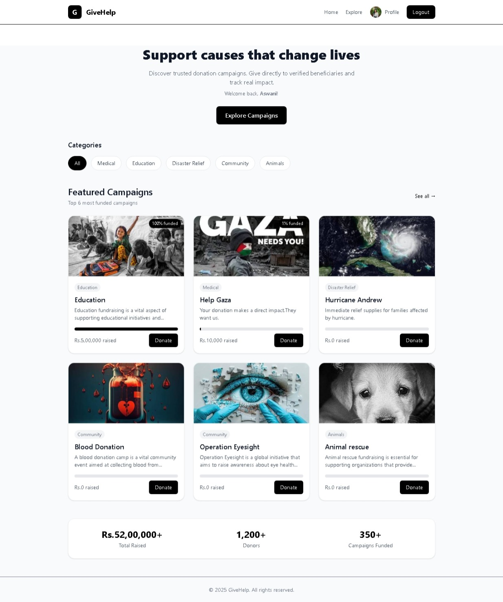
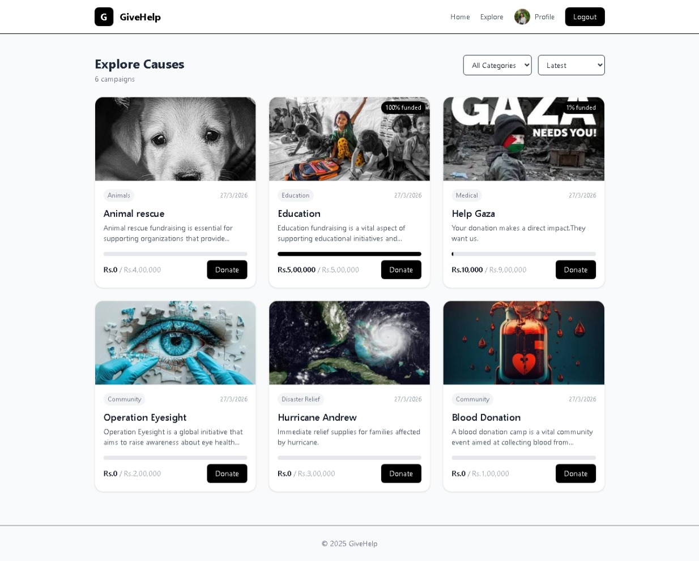
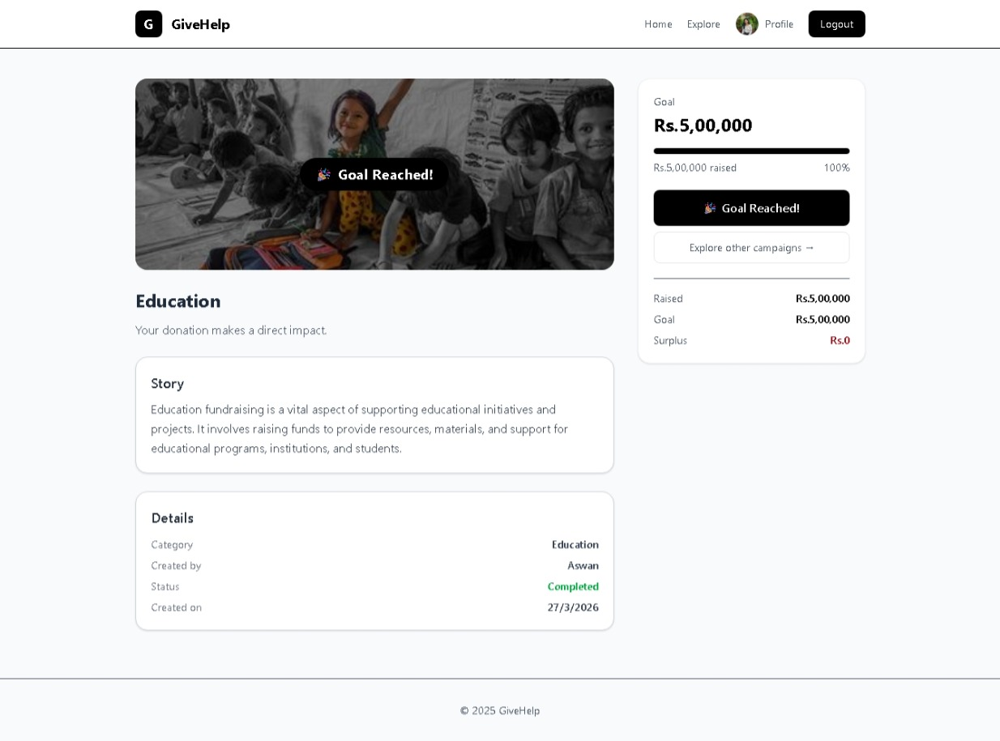
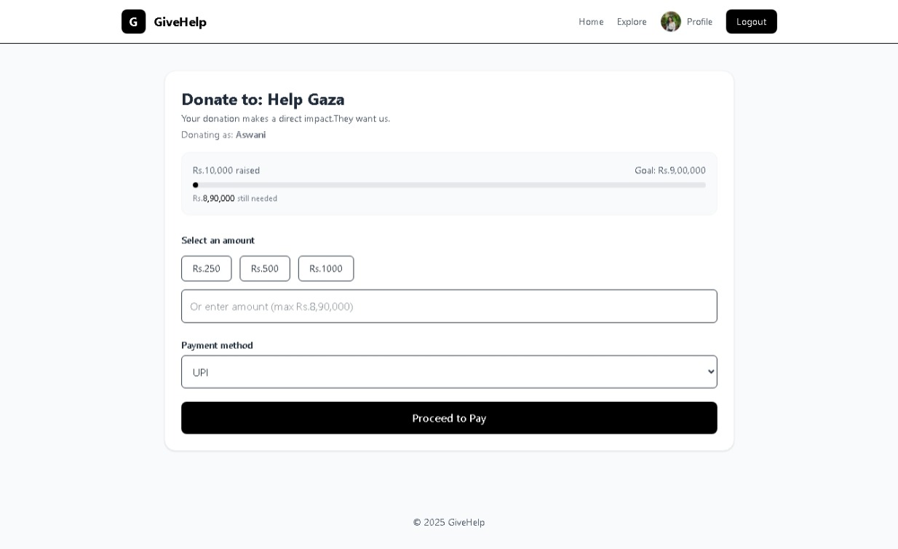
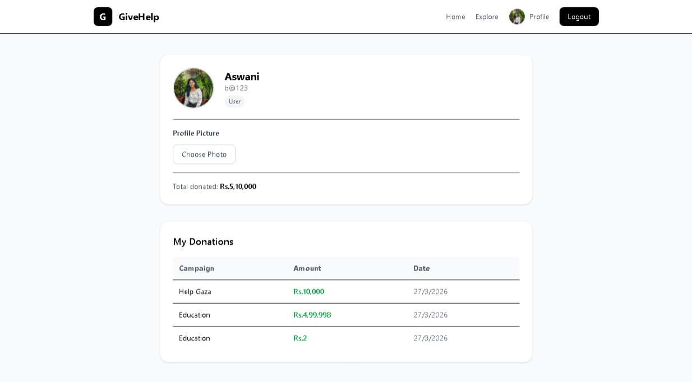
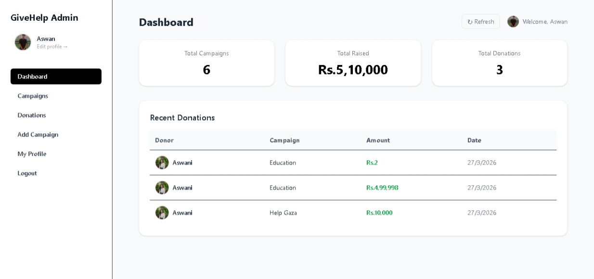

---

# ❤️ GiveHelp – Crowdfunding Platform

<p align="center">
A full-stack crowdfunding web application that allows users to explore fundraising campaigns and donate to meaningful causes.
</p>

<p align="center">
  
</p>

---

# 📖 Overview

**GiveHelp** is a modern crowdfunding platform where users can discover campaigns and contribute to causes that matter. The application allows users to view campaign details, track donation progress, and support fundraisers. Administrators can securely manage campaigns through an admin dashboard, including creating, updating, and deleting campaigns.

The project is built using a **React frontend**, **Node.js/Express backend**, and **MongoDB database**, and it is containerized using **Docker Compose** for easy setup and deployment.

---

# ✨ Features

### 👤 User

* Browse fundraising campaigns
* View campaign details
* Donate to campaigns
* Track fundraising progress
* Secure login and authentication

### 🛠️ Admin

* Create campaigns
* Update campaign information
* Delete campaigns
* Manage fundraising activities

---

# 🧰 Tech Stack

| Technology      | Purpose             |
| --------------- | ------------------- |
| ⚛️ React        | Frontend UI         |
| ⚡ Vite          | Frontend build tool |
| 🎨 Tailwind CSS | Styling             |
| 🟢 Node.js      | Backend runtime     |
| 🚂 Express.js   | Backend framework   |
| 🍃 MongoDB      | Database            |
| 🔐 JWT          | Authentication      |
| 🐳 Docker       | Containerization    |

---

# 🖼️ Application Screenshots

<p align="center">
  
  
  
</p>

<p align="center">
  
  
  
</p>

<p align="center">
  
  
  
</p>

---

# 📂 Project Structure

```
givehelp/
│
├── server/             # Backend (Node.js + Express)
├── ui/                 # Frontend (React + Vite)
├── docker-compose.yml
└── README.md
```

---

# 🚀 Running the Project with Docker

Follow the steps below to **build and run the application using Docker Compose**.

---

## 1️⃣ Clone the Repository

```bash
git clone https://github.com/your-username/givehelp.git
cd givehelp
```

---

## 2️⃣ Ensure Docker is Installed

Check Docker installation:

```bash
docker --version
docker compose version
```

Make sure **Docker Desktop is running**.

---

## 3️⃣ Build and Start Containers

Run the following command from the **project root directory**:

```bash
docker compose up --build
```

This will:

* Build the frontend container
* Build the backend container
* Start MongoDB
* Launch the full application

---

## 4️⃣ Access the Application

| Service        | URL                                            |
| -------------- | ---------------------------------------------- |
| 🌐 Frontend    | [http://localhost:3000](http://localhost:3000) |
| ⚙️ Backend API | [http://localhost:5000](http://localhost:5000) |
| 🗄️ MongoDB    | mongodb://localhost:27017                      |

---

# 🔮 Future Improvements

* Payment gateway integration
* Email notifications
* Campaign comments
* Social sharing
* Advanced analytics dashboard

---


# 👨‍💻 Author

**Aswani Vijoy**

---

⭐ If you find this project useful, consider giving it a **star**.

---


